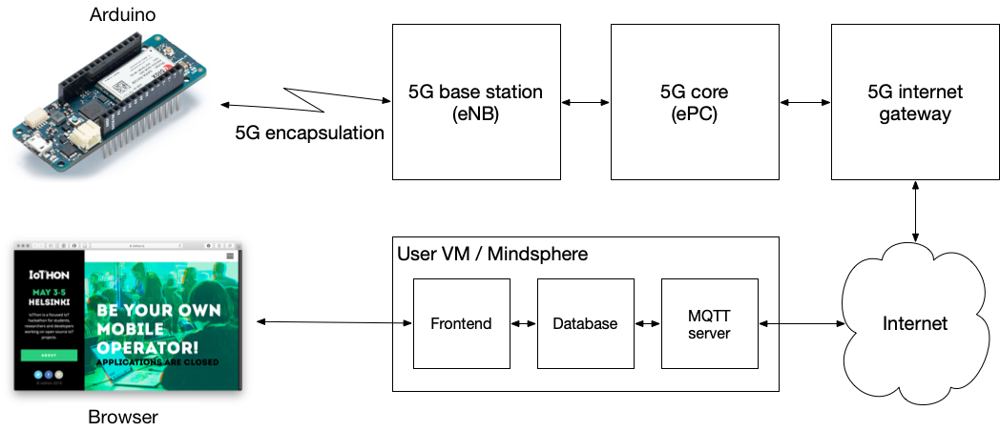

# IoT data monitoring with MQTT, InfluxDB and Grafana

This repository contains a
[docker-compose](https://docs.docker.com/compose/) and
[Arduino MKR NB 1500](https://store.arduino.cc/arduino-mkr-nb-1500)
based project for monitoring some real world sensor over an NB-IoT network.

The work is based on [Gautier Mechling](https://github.com/Nilhcem)'s
[home-monitoring-grafana](https://github.com/Nilhcem/home-monitoring-grafana)
repository, described in his
[blog post](http://nilhcem.com/iot/home-monitoring-with-mqtt-influxdb-grafana).

The present repository has been adapted for the
[IoThon 2019](https://iothon.io) hackathon,
and is considerably different from Gautier Mechling's original one.

For connecting your IoT device to the cloud, and then your front end,
the overall network structure looks like the following:



Your Arduino will be communicating over the 5G network with you server
(denoteted as `User VM` in the figure), which runs some suitable software
to communicate with the Arduino, to store any needed data, and to provide
a user interface.

The default instructions below explain how to install and test the presented
approach using two computers:

1. A *laptop* (or similar) used to program the Arduino MKR NB 1500
2. A *server* (or similar) running an MQTT server, InfluxDB database,
   and Grafana data visualisation.

Of course, you don't need to have a laptop, but may instead have a
Raspberry Pi or similar, used to program the Arduino.  However,
we call that machine as a _laptop_ in these instructions.
If you want to, you can also run everything on a single machine.

**NOTE** that your *server* must have a public IP address for being
able to receive MQTT data over the NB-IoT network from your Arduino.
You should have this IP address handly, since you will need to know it
below.  If you are using an IoThon VM, you have received the IP
address when you signed for your VM information.

## A security note

Note that these instructions do not explain how to secure your
MQTT or other communication with your server, e.g., with TLS.  If you
want to use TLS, see e.g. this
[Dev Side Story](https://devsidestory.com/lets-encrypt-with-docker/)
for running a TLS front end on your server side.
For your Arduino, you may want to adapt from the
[instructions for securely connecting to Azure](https://create.arduino.cc/projecthub/Arduino_Genuino/securely-connecting-an-arduino-nb-1500-to-azure-iot-hub-af6470).

## Subfolders

The first three subfolders are prepared for your *server*:
- `00-docker`: Docker compose configuration for MQTT, InfluxDB and Grafana
- `01-mosquitto`: Docker container configuration files for Eclipse [Mosquitto](https://mosquitto.org)
- `02-bridge`: Python script that receives MQTT data and stores them to InfluxDB

The final subfolder is meant to be used in your *laptop*:
- `03-arduino_mqtt`: Arduino sketch file for the MKR NB 1500 that publishes sensor data to MQTT

## Setup

### Networking options

The networking between you server and your IoT device will be different
depending on which kind of a SIM you are using.  The instructions below
assume that you have a "normal" SIM, from a commercial vendor.  If you
have an IoThon 2019 Aalto/COMNET SIM, please see the
[Networking instructions](tunnelling/Networking.md).

### Cloning this repository to *both* your laptop and your server

For cloning this repository, you need
[git](https://en.wikipedia.org/wiki/Git).  Most probably your Linux or
Mac OS X has it already.  For Windows (or if your Linux/whatever doesn't
have git), you can follow the
[official instructions](https://git-scm.com/book/en/v2/Getting-Started-Installing-Git).
If you haven't worked with git before, you may want to install
[GitHub Desktop](https://desktop.github.com) instead.

Once you have `git` installed, clone this repository to a suitable
folder in *both* of your *laptop* and *server*.  On the command line, simply give the command

```sh
   git clone https://github.com/iothon/docker-compose-mqtt-influxdb-grafana.git
   cd docker-compose-mqtt-influxdb-grafana
```
Alternatively, use your GitHub Desktop or equivalent.

### Installing docker and docker compose to your *server*

Install
[docker](https://docs.docker.com) and
[docker-compose](https://docs.docker.com/compose/), if you don't have
them installed in your *server* yet.
If you don't know if you have them installed or not, simply try to run the
commands `docker` and `docker-compose` on the command line.

For Windows or Mac OS X, the easiest way is to install
[Docker for Desktop](https://www.docker.com/products/docker-desktop).
Alternatively, for Mac OS X you can use [Homebrew](https://brew.sh),
with `brew install docker docker-compose`.

For Linux (Ubuntu or other Debian based), just use `apt install`:

```sh
   sudo apt install docker.io
   sudo apt install docker-compose
```

For anything else, follow the [official instructions](https://docs.docker.com/install/).

### Manage docker as a non-root user

In Linux, if you don't want to use `sudo` in the front of every `docker` or
`docker-compose` command below, you need to assing yourself to the `docker` group.
You can follow the [official instructions](https://docs.docker.com/install/linux/linux-postinstall/).

For the IoThon Ubuntu default VM, just give the following command:
```sh
   sudo usermod -aG docker iothon
```

Log out from your SSH session (or terminal) and log in again (or open new terminal).

## Running Mosquitto + InfluxDB + Grafana in docker, in your *server*

Set the `DATA_DIR` environment variable to the path where will be stored local data, e.g. `/tmp`
if you are just testing.  For your IoThon demonstration or other "production", choose
something else.

```sh
   export DATA_DIR=/tmp
```
(Note: For Mac OS X with Docker for Desktop, use `export DATA_DIR=/private/tmp` instead,
as docker has problems in understanding that `/tmp` is a symbolic link.)

Create data directories, with write access for the Mosquitto and Grafana containers:

```sh
   mkdir -p ${DATA_DIR}/mosquitto/data ${DATA_DIR}/mosquitto/log ${DATA_DIR}/influxdb ${DATA_DIR}/grafana
   sudo chown -R 1883:1883 ${DATA_DIR}/mosquitto
   sudo chown -R 472:472 ${DATA_DIR}/grafana
```

Run docker compose:

```sh
   cd 00-docker
   docker-compose up -d
```

This starts four containers on your *server*: Mosquitto, InfluxDB, Grafana, and
the Mosquitto-to-InfluxDB bridge from the `02-bridge` folder.  You can check that
they are nicely up and running with

```sh
   docker ps
```

You should see all the four containers running continuously, and not restarting.
If any of them is restarting, you can use `docker logs <container-name>` to see its
logs, or `docker exec -it <container-name> sh` to run a shell in the container.

To shut down your containers, e.g. if you need to change the settings, run
```sh
   docker-compose down
```

You can now test your Granafa at http://<your-server-ip>:3000.  See below how to
log in to and configure Grafana, and how to get the data flowing.

The Mosquitto username and passwords are `mqttuser` and `mqttpassword`.
To change these, see the **Optional: Update mosquitto credentials** section below.

## Grafana setup

It is a good idea to log in your Grafana right away and change your
`admin` password.  You can also add an InfluxDB data source already now,
or later.  For having a meaningful Dashboard, you must first get some
data to your InfluxDB database.

- Access Grafana from `http://<your-server-ip>:3000`
- Log in with user/password `admin/admin`
- Go to Configuration > Data Sources
- Add data source (InfluxDB)
  - Name: `InfluxDB`
  - URL: `http://influxdb:8086`
  - Database: `iothon_db`
  - User: `root`
  - Password: `root`
  - Save & Test
- Create a Dashboard
  - Add Graph Panel
  - Edit Panel
  - Data Source: InfluxDB
  - FROM: `[default] [temperature] WHERE [location]=[bme280]`
  - SELECT: `field(value)`
  - FORMAT AS: `Time series`
  - Draw mode: Lines
  - Stacking & Null value: Null value [connected]
  - Left Y
    - Unit: Temperature > Celcius
  - Panel title: Temperature (°C)

## Programming the sensor(s) with your *laptop*

For programming your sensors, the easiest way is to use the
[Arduino IDE](https://www.arduino.cc/en/Main/Software).  If you
are more experienced, you can also
[use GCC and a flasher directly](03-arduino_mqtt/Using-GCC.md).

Sensors should send data to the mosquitto broker to the following MQTT topic:
`iothon/{peripheralName}/{sensorname}`.
For example: `iothon/mkrnb1500/temperature`.

Arduino sketches for the MKR NB 1500 are provided to in `03-arduino_mqtt`.
See the `README.md` [file there](03-arduino_mqtt/README.md).

Before flashing, you need to change the `MQTT_SERVER` constant to MQTT *server* IP address.

**NOTE!** If you are using an Aalto/COMNET SIM, the server IP address needs to be
an inner private address, e.g. `10.200.1.100.`  If you are using a normal SIM from
a commercial vendor, the server IP address needs to be its public IP address in
the global network.

For using any interesting sensors, you will need to modify the sketch to
use a suitable sensor driver to fetch the data from the sensor and to pass
it via MQTT to your server.

## Testing MQTT without a sensor

If you want to test your server setup without your sensors, e.g. to make sure
that your server works while you are debugging your sensor, we recommend
[MQTT.FX](http://mqttfx.org).  Install the latest version, click the
gear wheel icon to add a Connection Profile for your Mosquitto server,
and publish some data on a topic, as explained above.

For your Connection Profile, you can use the following data:
```
   Profile Name      whatever you like
   Profile Type      MQTT Broker
   Broker Address    your server ip
   Broker Port       1883
   Client ID         whatever you like
   User Name         mqttuser     # or as changed, see below
   Password          mqttpassword # or as changed, see below
```

To see that your server works, the easiest way is to inspect your
MQTT bridge logs:
```sh
   docker logs mqttbridge
```

To enter some data, Connect, and Publish, e.g. at `iothon/testing/temperature`.

## Optional: Update mosquitto credentials

To change default MQTT username and password, run the following, replacing `<USER>` and `<PASSWORD>`:

```sh
   cd 01-mosquitto
   echo -n "" > users
   docker run --rm -v `pwd`/mosquitto.conf:/mosquitto/config/mosquitto.conf \
                   -v `pwd`/users:/mosquitto/config/users eclipse-mosquitto:1.5 \
              mosquitto_passwd -b /mosquitto/config/users <USER> <PASSWORD>
   cd ..
```

Then, update the `MQTT_USER` and `MQTT_PASSWORD` constants in all the subdirectories, and launch docker compose again.

## Definition of done

Once you have your cloud and sensor communicating, you should see the
(fake) temperature and/or RSSI data getting entered into your InfludDB
by the `mqttbridge`, as can be verified with `docker logs mqttbridge`.
For visualising it, see the [Grafana](#Grafana_setup) instructions above.

Once you have your data being visualised, you are on your own to innovate.

## Next steps

For hints what you can do with the Arduino, see the
[README](03-arduino_mqtt/README.md) for the MKR NB 1500 sketch.

For the cloud, you are more or less on our own.  Good starting
points for potentially problematic parts are the following:
* [Docker networking tutorial video](https://blog.docker.com/2015/04/docker-tutorial-5-basic-networking/)
* [Docker networking with standalone containers](https://docs.docker.com/network/network-tutorial-standalone/)
* [Docker networking in Compose](https://docs.docker.com/compose/networking/)

The [Docker compose script](/iothon/docker-compose-mqtt-influxdb-grafana/blob/master/00-docker/docker-compose.yml)
creates by default a new Docker network, `00-docker_default`, using the compose directory name.
You can inspect the network with `docker network inspect 00-docker_default`.
