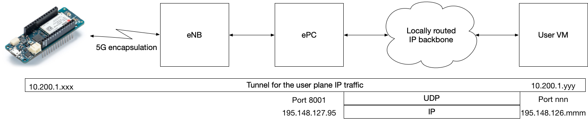

# Networking between an NB-IoT device and a server

The usual way NB-IoT devices are provisioned is that they have a
public or NATted IPv4 address, which is connected to the Internet.
Hence, they can connect any IP public address.

The VMs we are providing at IoTHon have a public IP address.

Hence, if you are using some commercial or other "normal" SIM in your
NB-IoT device, you can just provision everything "normally", and not
worry about the networking or IP addresses other than your server's
public IP.

However, if you want to hack the network, then you need an
Aalto/COMNET provisioned SIM, and things will be different.

## A brief introduction to the 5G core

Conceptuall, the 5G core sits between a basestation, called eNB, and
the Internet; see below for a figure.  By modifying the core you can
freely set the traffic from each IoT device to be send anywhere,
encapsulated or not.

A 5G core consists of a number of components, such as HSS, AMF, SMF,
UPF, etc.  In the IoThon 2019 settings, these work in a single PC,
called ePC, or a virtual machine.  Hopefully we will have them also
isolated into dockers before the end of the hackathon, but at this
writing we are not there yet.

## Aalto/COMNET NB-IoT 5G provisioning

The NB-IoT basestation used at IoThon is connected directly to an ePC
that is managed by the COMNET staff.  By default, the IoT traffic
is encapsulated into an IP-over-UDP-over-IP tunnel, whose termination
point needs is configured inside the core.



In principle, you should be able to have whatever traffic you want
within your IP tunnel, but in practice only simple UDP and TCP has
been tested.

To correctly terminate the IP-over-UDP-over-IP tunnel at your server,
called _User VM_ in the figure, you have to setup the tunnel end
at your server.

### FOU tunnel termination

In Linux, an IP-over-UDP-over-IP tunnel is called a
[Foo over UDP](https://lwn.net/Articles/614348/), or FOU, as it can be
used to tunnel also other protocols but IP.  In the Linux
implementation, the transmit and receive sides have been separated,
meaning that for a fully working tunnel both sides need to be
configured.

To configure a tunnel, you need the following parameters:
```sh
   export FOU_LOCAL_PORT=nnn
   export FOU_LOCAL_IP=195.148.126.mmm

   export FOU_REMOTE_PORT=8001
   export FOU_REMOTE_IP=195.148.127.95
```

#### Configuring receiving FOU tunnel end

At the receiving end, the kernel needs to know at which UDP port
listen for traffic, and what kind of packets one expects to receive
inside the UDP packets.

First the relevant kernel module is needed:
```sh
   modprobe fou
```

Then you need to configure the local receiving port:
```sh
   ip fou add port $FOU_LOCAL_PORT ipproto 4
```

With this, the kernel will accept whatever IP packets that come UDP
encapsulated to the `$FOU_LOCAL_PORT`.

If you care about security, you want to add some suitable `iptables`
rules to make sure that you only accept UDP pacekts from your ePC, and
that the incoming tunneled IP packets are what you expect.

#### Configuring outgoing FOU tunnel end

At the transmitting end, the kernel needs to be configured with at
tunnel interface that send the outgoing packets over UDP:
```sh
   ip link add name fou0 type ipip \
      remote $FOU_REMOTE_IP local $FOU_LOCAL_IP \
      encap fou encap-sport $FOU_LOCAL_PORT encap-dport $FOU_REMOTE_PORT encap-csum \
      dev eth0
```

With this, the kernel will encapsulate any outgoing traffic at the
newly created `fou0` interface with `ipip` encapsulation, using `fou`
(i.e. UDP) as the packet format, sending the UDP packets from
`$FOU_LOCAL_IP:$FOU_LOCAL_PORT` to `$FOU_REMOTE_IP:$FOU_REMOTE_PORT`.

We still need to tell the kernel to turn the tunnelling and `fou0`
interfaces up:
```sh
   ip link set up dev tunl0
   ip link set up dev fou0
```

#### Enabling routing

Finally, we have to tell the kernel what packets to route through the
`fou0` tunnel out, and optionally set up a local IP address binding
for the packets coming from the tunnel.

For example, with the default COMNET SIM provisioning you can
use the following
```sh
   ip addr add 10.200.1.1/24 dev fou0
```

## Example scripts

You can find example scripts for this in the `tunnelling` folder.
